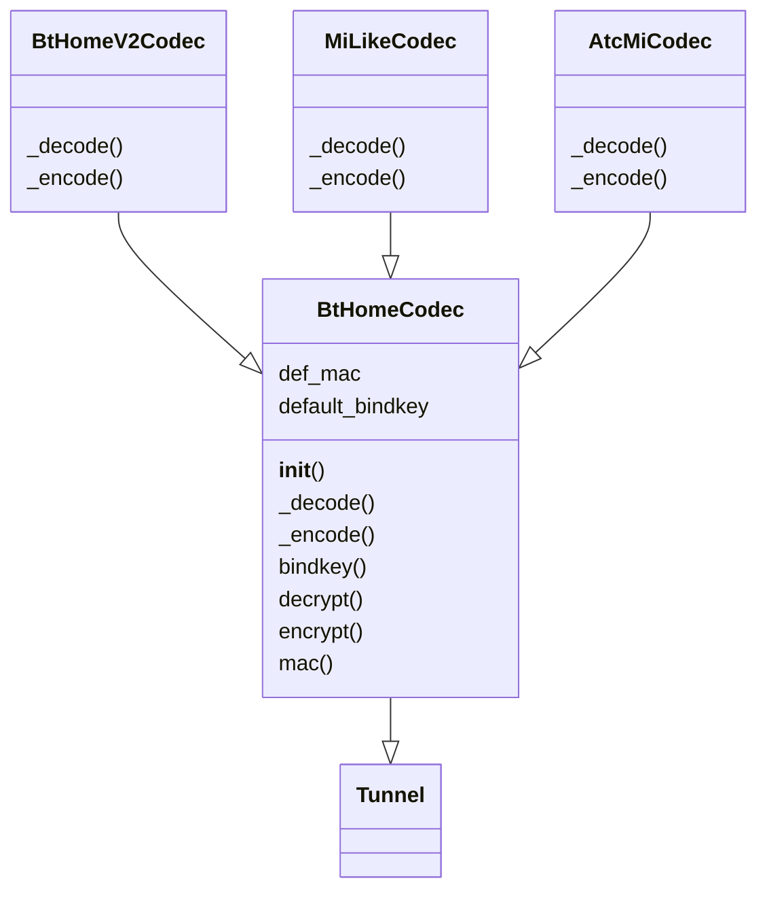
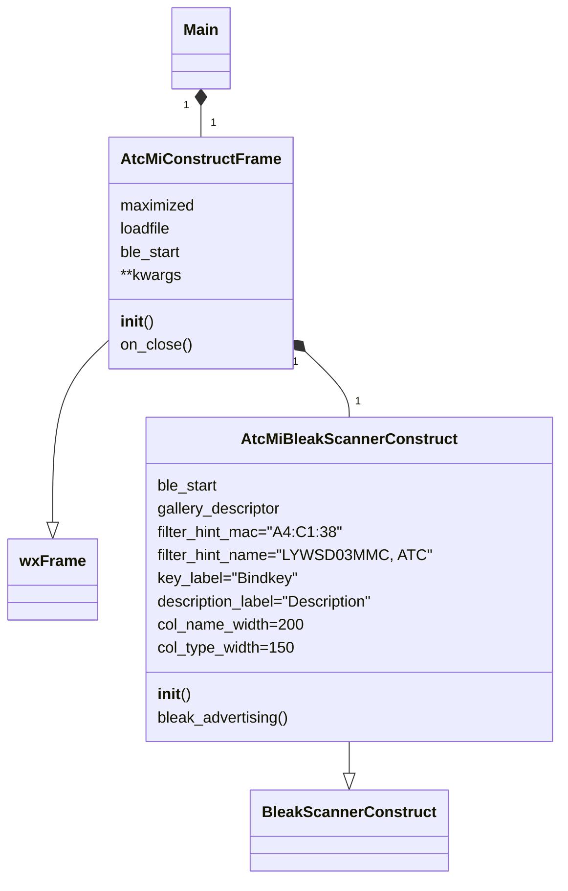
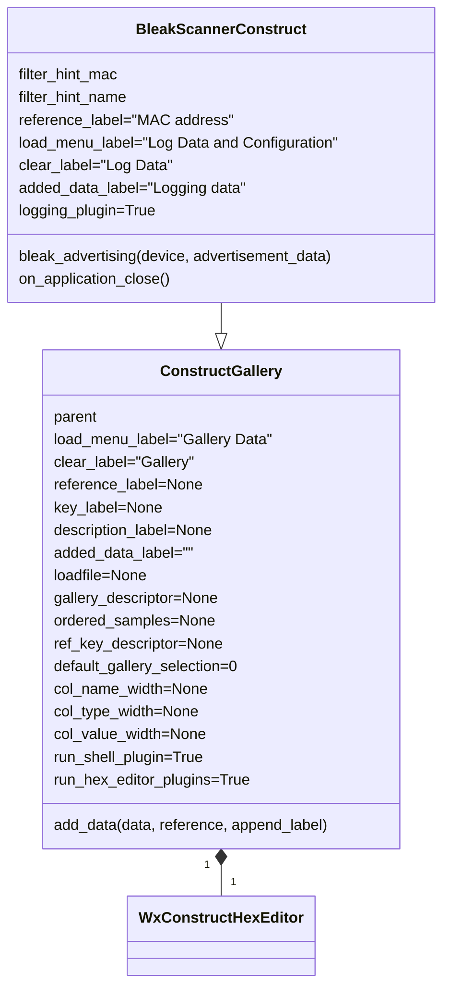
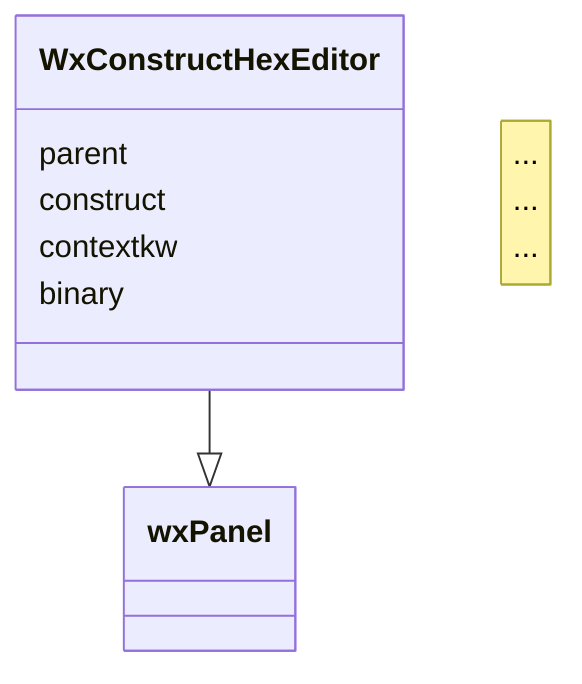
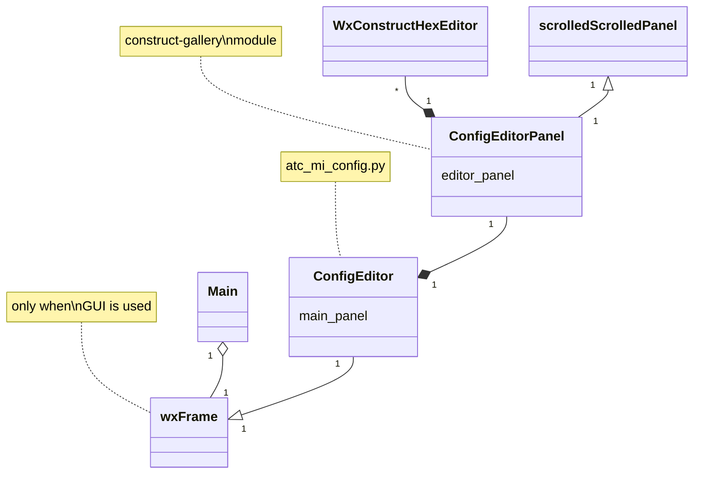

# Python interfacing methods and data representation model

[](https://pypi.org/project/atc-mi-interface)
[](https://pypi.org/project/atc-mi-interface/)
[](https://pypi.python.org/pypi/atc-mi-interface/)
[](https://raw.githubusercontent.com/pvvx/ATC_MiThermometer/master/LICENSE)

These programs and descriptions are provided by [Ircama](https://github.com/Ircama).

This section describes the Python components (API and command-line tools, including some GUI) to represent the data model of the BLE advertisements produced by the custom firmware, as well as a documented interface and a testing tool to receive, decode, show and edit the BLE advertisements delivered via the custom firmware. Additional features allow browsing and editing the full configuration of the device.

The base components used here are:

- [bleak](https://bleak.readthedocs.io/en/latest/), a cross-platform BLE library;
- [construct](https://construct.readthedocs.io/en/latest/intro.html), a symmetric Python library allowing to declaratively define a data structure that describes the advertisement frames produced by the custom firmware, as well as the related configuration frames;
- [construct-gallery](https://github.com/Ircama/construct-gallery), a set of tools extending [construct-editor](https://github.com/timrid/construct-editor/), which provides a GUI (based on [wxPython](https://www.wxpython.org/)) for *construct*. All these tools are used here, including plugins and [bleak_scanner_construct.py](atc_mi_interface/bleak_scanner_construct.py), a library to browse BLE advertisements.

The software in this section includes:

- a [*construct* data model](atc_mi_interface/atc_mi_construct.py) representing the *custom*, *atc1441*, *mi_like*, *bt_home* (version 1) and *bt_home_v2* (version 2) formats, respectively in clear and encrypted structures, with a documented interface to decode, browse and build the structures of BLE advertisements;
- the [`atc_mi_advertising_format(advertisement_data)`](atc_mi_interface/atc_mi_adv_format.py) function, to easily process BLE advertisements;
- an easy to use [BLE Advertisement Browser GUI](atc_mi_interface/atc_mi_advertising.py) based on the [wxPython](https://www.wxpython.org/) cross-platform desktop GUI toolkit, including controls on the BLE advertisements, map of MAC addresses, bindkeys, etc;
- a [configuration tool](atc_mi_interface/atc_mi_config.py) allowing to browse and edit the configuration parameters of the latest releases of the "pvvx" firmware, with a command-line interface and optionally with a GUI, including the possibility to use this configuration feature as an API.

## Installation

The software is delivered as a package named *atc-mi-interface*, which can be installed and referenced as *atc_mi_interface*, or can be run from the current directory after downloading it and having installed prerequisites.

Minimum Python version: 3.8. Updating `pip` to the latest version is suggested.

### Package installation

The package can be installed from PyPI with the following command:

```cmd
pip install atc-mi-interface
```

If also the GUI has to be run, use the following command instead of the previous one:

```cmd
pip install atc-mi-interface[gui]
```

All prerequisites are automatically installed and the package can be immediately referenced as *atc_mi_interface*.

The package also installs the following three entry-points, which can be run from the command-line: *atc_mi_advertising*, *atc_mi_config* and *atc_mi_format_test*. These entry-points are related to tools that can also be invoked through the `atc_mi_interface -a | -c | -t` global command-line options, as in the following usage:

```
usage: atc_mi_interface [-h] (-a | -c | -t) [-H] [-V]

Subsequent options must follow, related to the selected tool. The first argument is the option which selects the tool
(advertising, config, or test) and must be separated from the subsequent tool options, to be placed in other
arguments.

optional arguments:
  -h, --help         show this help message and exit
  -a, --advertising  Run the atc_mi_advertising tool
  -c, --config       Run the atc_mi_config tool
  -t, --test         Run the atc_mi_format_test tool
  -H, --help-option  Invoke the specific help of the selected tool
  -V, --version      Print version and exit

atc_mi_interface tools
```

To uninstall the package:

```cmd
pip uninstall -y atc-mi-interface
```

Alternative installation from GitHub:

```cmd
pip install "git+https://github.com/pvvx/ATC_MiThermometer.git#egg=atc-mi-interface&subdirectory=python-interface"
```

If also the GUI has to be run, use the following command instead of the previous one:

```cmd
pip install "git+https://github.com/pvvx/ATC_MiThermometer.git#egg=atc-mi-interface[gui]&subdirectory=python-interface"
```

Another way to install it from GitHub is the following:

```cmd
git clone https://github.com/pvvx/ATC_MiThermometer
cd ATC_MiThermometer/python-interface

pip install .
```

If also the GUI has to be run, replace `pip install .` with `pip install .[gui]`.

### Additional prerequisites for Raspberry Pi

```
sudo apt-get install -y libgtk-3-dev  # if GUI is needed
python3 -m pip install attrdict
```

The GUI prerequisites take sensible storage space on a Rasperry Pi.

With Raspberry Pi, the *bleak* prerequisite also requires *dbus-fast*, which needs to build the Python *wheel* (related compilation takes some time).

### Note with Python 3.11 when using the GUI

With Python 3.11 replace *attrdict* with *attrdict3*:

```
python3 -m pip uninstall attrdict
python3 -m pip install attrdict3
```

The C compiler is needed too.

With Python 3.12, *attrdict* might still be a problem.

Usage of Python 3.10 is suggested.

### Running the package without installation

Alternatively from installation, the execution can be directly performed from the package directory, using *requirements.txt* and *gui-requirements.txt* to install the prerequisites:

```bash
cd ATC_MiThermometer/python-interface
pip3 install -r requirements.txt
```

For using the GUI option, the installation of prerequisites needs to also add *gui-requirements.txt*:

```bash
cd ATC_MiThermometer/python-interface
pip3 install -r requirements.txt -r gui-requirements.txt
```

The above command can also be used to subsequently install the GUI prerequisites if the package installation was missing of the `[gui]` extra.

Example of execution of *atc_mi_advertising* from the current package directory with installation of prerequisites:

```cmd
git clone https://github.com/pvvx/ATC_MiThermometer
cd ATC_MiThermometer/python-interface
pip3 install -r requirements.txt -r gui-requirements.txt
python3 -m atc_mi_interface.atc_mi_advertising  # or python3 -m atc_mi_interface -a
```

## Decoding and encoding

To only test decoding and encoding, the standard package installation procedure (which also loads *bleak*) is not needed and the following prerequisites can be manually installed instead:

```
python3 -m pip install construct pycryptodome arrow
```

Parsing a [*custom* frame](https://github.com/pvvx/ATC_MiThermometer#custom-format-all-data-little-endian):

```python
from atc_mi_interface import general_format
print(general_format.parse(bytes.fromhex(
    "12 16 1a 18 5c c8 ee 38 c1 a4 b0 08 c3 14 ca 0a 50 14 05")))
```

Output:

```python
Container:
    version = 1
    custom_enc_format = ListContainer:
    custom_format = ListContainer:
        Container:
            version = 1
            size = 18
            uid = 22
            UUID = b"\x18\x1a" (total 2)
            MAC = u"A4:C1:38:EE:C8:5C" (total 17)
            mac_vendor = u"Telink Semiconductor" (total 20)
            temperature = 22.24
            temperature_unit = u"°C" (total 2)
            humidity = 53.15
            humidity_unit = u"%" (total 1)
            battery_v = 2.762
            battery_v_unit = u"V" (total 1)
            battery_level = 80
            battery_level_unit = u"%" (total 1)
            counter = 20
            flags = Container:
                humidity_trigger = False
                temp_trigger = False
                out_gpio_trg_flag = True
                out_gpio_trg_value = False
                input_gpio_value = True
    atc1441_enc_format = ListContainer:
    atc1441_format = ListContainer:
    mi_like_format = ListContainer:
    bt_home_format = ListContainer:
    bt_home_enc_format = ListContainer:
    bt_home_v2_format = ListContainer:
```

The following example shows how to parse any type of format (*custom*, *atc1441*, *mi_like*, *bt_home*, *bt_home_v2*, either they are encrypted or not). The right format is automatically selected basing on the frame type:

```python
from atc_mi_interface import general_format

frame1 = bytes.fromhex("12 16 1a 18 cc bb aa 38 c1 a4 77 07 88 13 ca 0a 50 01 07")

atc_mi_data = general_format.parse(frame1)

print("temperature:", atc_mi_data.search_all("^temperature"))
print("humidity:", atc_mi_data.search_all("^humidity"))
print("battery_level:", atc_mi_data.search_all("^battery_level"))
print("battery_v:", atc_mi_data.search_all("^battery_v"))

print()

frame2 = bytes.fromhex("16 16 1e 18 ec 12 cf e5 00 00 3a f3 95 3c a0 5a 7d 03 00 2a ea f8 ea")
bindkey = bytes.fromhex("AAAAAAAAAAAAAAAAAAAAAAAAAAAAAAAA")
mac_address = bytes.fromhex("A4:C1:38:AA:BB:CC".replace(":", ""))

atc_mi_data = general_format.parse(frame2, bindkey=bindkey, mac_address=mac_address)

print("temperature:", atc_mi_data.search_all("^temperature"))
print("humidity:", atc_mi_data.search_all("^humidity"))
print("battery_level:", atc_mi_data.search_all("^battery_level"))
print("battery_v:", atc_mi_data.search_all("^battery_v"))
```

Output:

```python
temperature: [19.11, "°C"]
humidity: [50.0, "%", False]
battery_level: [80, "%"]
battery_v: [2.762, "V"]

temperature: [20.0, "°C"]
humidity: [50.0, "%"]
battery_level: [100, "%"]
battery_v: []
```

Alternatively to `general_format`, also `custom_format` can be used to decode *frame1* and `bt_home_enc_format` to decode *frame2* (after importing them).

Building the frame with the reverse process:

```python
from atc_mi_interface import custom_format

custom_format.build(
    {
        "size": 18,
        "uid": 22,
        "UUID": b"\x18\x1a",
        "MAC": "A4:C1:38:AA:BB:CC",
        "temperature": 19.11,
        "humidity": 50.0,
        "battery_v": 2.762,
        "battery_level": 80,
        "counter": 1,
        "flags": {
            "humidity_trigger": False,
            "temp_trigger": False,
            "out_gpio_trg_flag": True,
            "out_gpio_trg_value": True,
            "input_gpio_value": True,
        },
    }
).hex(" ")
```

Output:

```
"12 16 1a 18 cc bb aa 38 c1 a4 77 07 88 13 ca 0a 50 01 07"
```

## Encrypting and decrypting

All encoded versions of the *construct* structures (*custom_enc_format*, *atc1441_enc_format*, *bt_home_enc_format*, *mi_like_format* with the "isEncrypted" flag, *bt_home_v2_format* with the "Encryption" flag) support the following additional parameters:

- `mac_address`: MAC address in bytes (e.g., `bytes.fromhex("A4:C1:38:AA:BB:CC".replace(":", ""))`)
- `bindkey`: Bindkey in bytes (e.g., `bytes.fromhex("AAAAAAAAAAAAAAAAAAAAAAAAAAAAAAAA")`)

Alternatively (but not suggested), if the same MAC address and key are needed for all queries of a specific parser, the parameters can be put in *atc_mi_construct.py* within the related `"codec"` adapter, like with the following:

```python
...
    "codec" / AtcMiCodec(
        Struct(
            ...
        ),
        mac_address=bytes.fromhex("A4:C1:38:AA:BB:CC".replace(":", "")),
        bindkey=bytes.fromhex("AAAAAAAAAAAAAAAAAAAAAAAAAAAAAAAA")
    ),
)
```

The following example uses the `general_format` to parse an array of bytes encoded with the `custom_enc_format` encrypted format:

```python
from atc_mi_interface import general_format

print(
    general_format.parse(
        bytes.fromhex("0e 16 1a 18 bd 9d c5 4e fa b5 00 0e 8b b8 07"),
        mac_address=bytes.fromhex("A4:C1:38:AA:BB:CC".replace(":", "")),
        bindkey=bytes.fromhex("AAAAAAAAAAAAAAAAAAAAAAAAAAAAAAAA"),
    )
)
```
    
Output:

```python
Container:
    version = 1
    custom_enc_format = ListContainer:
        Container:
            version = 1
            size = 14
            uid = 22
            UUID = b"\x18\x1a" (total 2)
            codec = Container:
                temperature = 19.11
                temperature_unit = u"°C" (total 2)
                humidity = 50.0
                humidity_unit = u"%" (total 1)
                battery_level = 93
                battery_level_unit = u"%" (total 1)
                flags = Container:
                    humidity_trigger = False
                    temp_trigger = True
                    out_gpio_trg_flag = True
                    out_gpio_trg_value = True
                    input_gpio_value = True
    custom_format = ListContainer:
    atc1441_enc_format = ListContainer:
    atc1441_format = ListContainer:
    mi_like_format = ListContainer:
    bt_home_format = ListContainer:
    bt_home_enc_format = ListContainer:
    bt_home_v2_format = ListContainer:
```

Building the frame with the reverse process:

```python
from atc_mi_interface import custom_enc_format

custom_enc_format.build(
    {
        "size": 14,
        "uid": 22,
        "UUID": b"\x18\x1a",
        "codec": {
            "temperature": 19.11,
            "humidity": 50.0,
            "battery_level": 80,
            "counter": 1,
            "flags": {
                "humidity_trigger": False,
                "temp_trigger": False,
                "out_gpio_trg_flag": True,
                "out_gpio_trg_value": True,
                "input_gpio_value": True,
            }
        }
    },
    mac_address=bytes.fromhex("A4:C1:38:AA:BB:CC".replace(":", "")),
    bindkey=bytes.fromhex("AAAAAAAAAAAAAAAAAAAAAAAAAAAAAAAA"),
).hex(" ")
```

Output:

```
"0e 16 1a 18 bd 9d c5 4e fa b8 08 56 6b e8 7f"
```

For the build process, generally `Container` is mapped to a dictionary (`{ ... }`), `ListContainer` to a list (`[ ... ]`) and `(enum)` with a normal `key: value` inside a dictionary (with the strings in quotes).

Another parsing example using as input an array of bytes encoded with encrypted `bt_home_v2_format`:

```python
from atc_mi_interface import bt_home_v2_format

print(
    bt_home_v2_format.parse(
        bytes.fromhex("14 16 d2 fc 41 95 b0 ef da 78 9d d9 53 b0 26 00 00 93 41 62 6f"),
        mac_address=bytes.fromhex("A4:C1:38:AA:BB:CC".replace(":", "")),
        bindkey=bytes.fromhex("AAAAAAAAAAAAAAAAAAAAAAAAAAAAAAAA"),
    )
)
```

Output:

```python
Container:
    version = 1
    size = 20
    uid = 22
    UUID = b"\xfc\xd2" (total 2)
    DevInfo = Container:
        Version = 2
        Reserved2 = 0
        Trigger = False
        Reserved1 = 0
        Encryption = True
    data_point = Container:
        count_id = 9904
        payload = ListContainer:
            Container:
                bt_home_v2_type = (enum) BtHomeID_battery 1
                data = Container:
                    battery_level = 80
                    battery_level_unit = u"%" (total 1)
            Container:
                bt_home_v2_type = (enum) BtHomeID_temperature 2
                data = Container:
                    temperature = 19.2
                    temperature_unit = u"°C" (total 2)
            Container:
                bt_home_v2_type = (enum) BtHomeID_humidity 3
                data = Container:
                    humidity = 62.22
                    humidity_unit = u"%" (total 1)
```

Reverse process:

```python
from atc_mi_interface import bt_home_v2_format

bt_home_v2_format.build(
    {
        "size": 20,
        "uid": 22,
        "UUID": b"\xfc\xd2",
        "DevInfo": {
            "Encryption": True,
            "Reserved1": 0,
            "Reserved2": 0,
            "Trigger": False,
            "Version": 2,
        },
        "data_point": {
            "count_id": 9904,
            "payload": [
                {
                    "bt_home_v2_type": "BtHomeID_battery",
                    "data": {"battery_level": 80}
                },
                {
                    "bt_home_v2_type": "BtHomeID_temperature",
                    "data": {"temperature": 19.2}
                },
                {
                    "bt_home_v2_type": "BtHomeID_humidity",
                    "data": {"humidity": 62.22}
                },
            ]
        }
    },
    mac_address=bytes.fromhex("A4:C1:38:AA:BB:CC".replace(":", "")),
    bindkey=bytes.fromhex("AAAAAAAAAAAAAAAAAAAAAAAAAAAAAAAA"),
).hex(" ")
```

Output:

```
"14 16 d2 fc 41 95 b0 ef da 78 9d d9 53 b0 26 00 00 93 41 62 6f"
```

## Reading and updating single values

`Struct` collections defined in [atc_mi_construct.py](atc_mi_interface/atc_mi_construct.py) generally return a [`Container`](https://construct.readthedocs.io/en/latest/basics.html?highlight=dictionary#containers), that can be considered a regular Python dictionary. To read, set, update single values, the same dictionary statements can be used.

As an example, we first setup a `construct` collection from `cfg`, named `cfg_constr`:

```python
from atc_mi_interface import cfg

CFG_BYTES = "43 85 10 00 00 28 04 A9 31 31 04 B4"
cfg_constr = cfg.parse(bytes.fromhex(CFG_BYTES))

cfg_constr
```

Output:

```python
Container(version=1, firmware_version=Container(major=4, minor=3), flg=Container(lp_measures=True, tx_measures=False, show_batt_enabled=False, temp_F_or_C=uEnumIntegerString.new(0, "temp_C"), blinking_time_smile=uEnumIntegerString.new(0, "blinking_smile"), comfort_smiley=True, advertising_type=uEnumIntegerString.new(1, "adv_type_custom")), flg2=Container(screen_off=False, longrange=False, bt5phy=False, adv_flags=True, adv_crypto=False, smiley=uEnumIntegerString.new(0, "smiley_off")), temp_offset=0.0, temperature_unit=u"°C", humi_offset=0.0, humidity_unit=u"%", advertising_interval=2.5, adv_int_unit=u"sec.", measure_interval=4, rf_tx_power=uEnumIntegerString.new(169, "RF_POWER_Positive_0p04_dBm"), connect_latency=1.0, connect_latency_unit=u"sec.", min_step_time_update_lcd=2.45, min_s_t_upd_lcd_unit=u"sec.", hw_cfg=Container(sensor=uEnumIntegerString.new(0, "sensor_SHT4x"), reserved=0, hwver=uEnumIntegerString.new(4, "hwver_LYWSD03MMC_B1_6")), averaging_measurements=180)
```

To pretty print its content:

```python
print(cfg_constr)
# or pretty_output = str(cfg_constr)
```

Output:

```
Container:
    version = 1
    firmware_version = Container:
        major = 4
        minor = 3
    flg = Container:
        lp_measures = True
        tx_measures = False
        show_batt_enabled = False
        temp_F_or_C = (enum) temp_C 0
        blinking_time_smile = (enum) blinking_smile 0
        comfort_smiley = True
        advertising_type = (enum) adv_type_custom 1
    flg2 = Container:
        screen_off = False
        longrange = False
        bt5phy = False
        adv_flags = True
        adv_crypto = False
        smiley = (enum) smiley_off 0
    temp_offset = 0.0
    temperature_unit = u"°C" (total 2)
    humi_offset = 0.0
    humidity_unit = u"%" (total 1)
    advertising_interval = 2.5
    adv_int_unit = u"sec." (total 4)
    measure_interval = 4
    rf_tx_power = (enum) RF_POWER_Positive_0p04_dBm 169
    connect_latency = 1.0
    connect_latency_unit = u"sec." (total 4)
    min_step_time_update_lcd = 2.45
    min_s_t_upd_lcd_unit = u"sec." (total 4)
    hw_cfg = Container:
        sensor = (enum) sensor_SHT4x 0
        reserved = 0
        hwver = (enum) hwver_LYWSD03MMC_B1_6 4
    averaging_measurements = 180
```

As an alternative pretty printing mode, we can also use [`black`](https://black.readthedocs.io/):

```python
from black import format_str, FileMode  # pip install black
print(format_str(repr(cfg_constr), mode=FileMode()))
```

Output:

```python
Container(
    version=1,
    firmware_version=Container(major=4, minor=3),
    flg=Container(
        lp_measures=True,
        tx_measures=False,
        show_batt_enabled=False,
        temp_F_or_C=uEnumIntegerString.new(0, "temp_C"),
        blinking_time_smile=uEnumIntegerString.new(0, "blinking_smile"),
        comfort_smiley=True,
        advertising_type=uEnumIntegerString.new(1, "adv_type_custom"),
    ),
    flg2=Container(
        screen_off=False,
        longrange=False,
        bt5phy=False,
        adv_flags=True,
        adv_crypto=False,
        smiley=uEnumIntegerString.new(0, "smiley_off"),
    ),
    temp_offset=0.0,
    temperature_unit="°C",
    humi_offset=0.0,
    humidity_unit="%",
    advertising_interval=2.5,
    adv_int_unit="sec.",
    measure_interval=4,
    rf_tx_power=uEnumIntegerString.new(169, "RF_POWER_Positive_0p04_dBm"),
    connect_latency=1.0,
    connect_latency_unit="sec.",
    min_step_time_update_lcd=2.45,
    min_s_t_upd_lcd_unit="sec.",
    hw_cfg=Container(
        sensor=uEnumIntegerString.new(0, "sensor_SHT4x"),
        reserved=0,
        hwver=uEnumIntegerString.new(4, "hwver_LYWSD03MMC_B1_6"),
    ),
    averaging_measurements=180,
)
```

Reading values from `cfg_constr` (all are valid modes):

```python
print(cfg_constr.flg.tx_measures)
print(cfg_constr["flg"]["tx_measures"])
print(cfg_constr.flg.get("tx_measures"))
```

Assigning values to `cfg_constr` (all are valid modes):

```python
cfg_constr.flg.tx_measures = True
cfg_constr["flg"]["tx_measures"] = True
cfg_constr.flg.update({"tx_measures", True})
```

In addition, elements can also be searched:

```python
print(cfg_constr.search("tx_measures"))  # the first value is returned
print(cfg_constr.search_all("tx_measures"))  # a list is returned with all found values
```

Full example to update a byte sequence, setting a single value:

```python
from atc_mi_interface import cfg

CFG_BYTES = "43 85 10 00 00 28 04 A9 31 31 04 B4"  # initial byte sequence

cfg_constr = cfg.parse(bytes.fromhex(CFG_BYTES))  # first we create its "construct"
cfg_constr.flg.tx_measures = True  # then we update the value
new_cfg_bytes = cfg.build(cfg_constr)  # subsequently, we build the new byte sequence

print(new_cfg_bytes.hex(" ").upper())
```

Output:

```
43 C5 10 00 00 28 04 A9 31 31 04 B4
```

## Running the Packet Log Inspector Shell

Press the "Open Python Shell" button to run the Packet Log Inspector Shell.

Accessing the parsed structure:

```python
cfg_data = frame.main_panel.construct_hex_editor.construct_editor._model.root_obj
contextkw = frame.main_panel.construct_hex_editor.contextkw
frame.main_panel.construct_hex_editor.binary
```

To read a specific value, use the following examples:

```python
cfg_data.custom_format[0].temperature
cfg_data.bt_home_v2_format[0].data_point.payload[0].data.battery_level
```

Assign the variable to change it:

```python
cfg_data.custom_enc_format[0].codec.temperature = 18.5
cfg_data.bt_home_v2_format[0].data_point.payload[1].data.temperature = 19.2
```

Build the new bytes and update the UI:

```python
from atc_mi_interface import bt_home_v2_format
frame.main_panel.construct_hex_editor.binary = bt_home_v2_format.build(cfg_data.bt_home_v2_format[0], **contextkw)
```

## Processing BLE advertisements

After performing the [installation](#Installation) procedure, the simplest program to process BLE advertisements produced by the thermometers is the following:

```python
import asyncio
from bleak import BleakScanner
from functools import partial
from atc_mi_interface import general_format, atc_mi_advertising_format

bindkey = {
    "A4:C1:38:AA:BB:CC": bytes.fromhex("AAAAAAAAAAAAAAAAAAAAAAAAAAAAAAAA"),
    "A4:C1:38:AA:BB:00": bytes.fromhex("bbbbbbbbbbbbbbbbbbbbbbbbbbbbbbbb"),
    # ...
}

async def ble_coro():
    count = [0]
    stop_event = asyncio.Event()

    def detection_callback(count, device, advertisement_data):
        format_label, adv_data = atc_mi_advertising_format(advertisement_data)
        if not adv_data:
            return
        mac_address = bytes.fromhex(device.address.replace(":", ""))
        atc_mi_data = general_format.parse(
            adv_data,
            mac_address=mac_address,
            bindkey=(
                bindkey[device.address] if device.address in bindkey else None
            )
        )
        print(f"{count[0]}. {format_label} advertisement: {atc_mi_data}. "
            f"RSSI: {advertisement_data.rssi}")
        count[0] += 1
        if count[0] == 5:
            stop_event.set()

    async with BleakScanner(
        detection_callback=partial(detection_callback, count)
    ) as scanner:
        await stop_event.wait()
    print("Stopped")


asyncio.run(ble_coro())
```

The program [runs on](https://github.com/hbldh/bleak#features) Windows, Linux, OS/X, Raspberry Pi, Android. It prints the first 5 parsed frames from available thermometers, regardless their configurations. It exploits the `atc_mi_advertising_format()` function, which adds headers to the BLE advertisements produced by the thermometers and discovered by `BleakScanner()` (from *bleak*), so that the resulting frame can be directly processed by the *construct* structures included in the package.

After the advertisement dump (e.g., before the *count* increment), you can optionally add:

```python
        print("temperature:", atc_mi_data.search_all("^temperature"))
        print("humidity:", atc_mi_data.search_all("^humidity"))
        print("battery_level:", atc_mi_data.search_all("^battery_level"))
        print("battery_v:", atc_mi_data.search_all("^battery_v"))
```

## atc_mi_advertising: BLE Advertisement Browser GUI

[atc_mi_advertising](atc_mi_interface/atc_mi_advertising.py) is a Python GUI allowing BLE advertisement analysis of data transmitted by thermometers, including a function to edit data and perform testing.


To run the program (it requires the GUI prerequisites):

```bash
# run program:
python3 -m atc_mi_interface.atc_mi_advertising
```

With a proper Python installation, the entry-point `atc_mi_advertising` should also work in place of `python3 python3 -m atc_mi_interface.atc_mi_advertising`.

Program command line options:

```
usage: atc_mi_advertising [-h] [-s] [-m] [-l LOG_DATA_FILE [LOG_DATA_FILE ...]] [-i] [-V]

optional arguments:
  -h, --help            show this help message and exit
  -s, --start           start BLE
  -m, --maximized       display the frame maximized
  -l LOG_DATA_FILE [LOG_DATA_FILE ...], --load LOG_DATA_FILE [LOG_DATA_FILE ...]
                        log data file(s) to be automatically loaded at startup.
  -i, --inspectable     enable Inspection (Ctrl-Alt-I)
  -V, --version         Print version and exit

Xiaomi Mijia Thermometer - BLE Advertisement Browser
```

Summary of the possible invocation modes:

```
atc_mi_advertising <options>
python3 -m atc_mi_interface.atc_mi_advertising <options>
python3 -m atc_mi_interface -a <options>
python3 -m atc_mi_interface --advertising <options>
```

Main functionalities.
- BLE client to log, browse, test and edit advertisements produced by the Xiaomi Mijia Thermometers.
- Cross-platform GUI.
- The GUI includes a BLE control (implemented with buttons) which allows starting and stopping the BLE advertisement receiver. Advertisements are logged in their reception sequence, automatically labbelled basing on the discovered format and including related MAC address, so that they can be immediately selected by the user to browse and parse data.
- A filter button can be used to enter a specific MAC address to restrict logging, a portion of it or a sequence of addresses, as well as BLE local names.
- Logged data can be saved to file in [pickle format](https://docs.python.org/3/library/pickle.html). Archives can be subsequently reloaded and appended to the current log. They can also be inspected with `python -mpickle archive-file-name.pickle`.
- Advertisement data are logged in the left panel, shown as hex bytes in the central panel and then parsed to browsable *construct* structures in the right panel.
- The program uses the data model contained in `atc_mi_construct.py` to parse and build data and a special button allows the dynamic reloading of this module, so that it can be easily edited, tested and tuned for new features.
- Everything is GUI based. Also the Python error management is wrapped into a GUI panel.
- A Python shell button allows opening an inspector shell, which also provides a special *Help* with related submenu (or by pressing F9).
- All panels allow a context menu (invoked with the right click of the mouse) with a number of special functions.
  - The left log menu panel allows renaming labels and changing MAC address, as well as its related bindkey and description. Also, by double clicking an unused area of the log panel, new frames can be added and then labelled; subsequently, a specific MAC address can be associated. For each MAC address the related bindkey and description can be edited. Log elements can be repositioned, or deleted.
  - The hex editor (central panel) allows any kind of copy/paste. Sequences of bytes can be pasted [in a number of different formats](https://github.com/timrid/construct-editor/pull/17#issuecomment-1367582581). Also a special checkbox enables pasting Python expressions. Two debugging tools are also provided (invoked with the right click of the mouse after selecting a sequence of bytes), to convert bytes into a wide set of numeric forms as well as strings; these debug panels can be used to quickly check the most appropriate conversion method for a sequence of bytes.
  - The construct right panel is also enriched by a right-click context menu controlling a number of features. Notice for instance the possibility display values in dec or hex form, or to show hidden values.
- Encryption and decryprion are fully supported and a separate central panel in the lowest part of the screen shows the bytes produced by the related codec, mapping them with the referred structure in the right panel.
- The right panel allows changing all values (apart from the "Computed" ones) by double clicking the shown values, so that a new sequence of bytes is automatically built (including encryption when needed).
- A button shows a table allowing to edit MAC addresses and their related Bindkey and description.
- The program has command line arguments and one allows loading a saved log at startup; another option automatically starts the BLE advertisement receiver.
- When starting the BLE reception, a debug window is opened in background, with the possibility to control the debug level and clear the produced data.
- The `-i` command line option is for [debugging](https://wiki.wxpython.org/How%20to%20use%20Widget%20Inspection%20Tool%20-%20WIT%20%28Phoenix%29), which can be activated with Ctrl-Alt-I, or Cmd-Alt-I on Mac.

## atc_mi_format_test

The stand-alone sample program [atc_mi_interface.atc_mi_format_test](atc_mi_interface/atc_mi_format_test.py), which can be run with `python3 -m atc_mi_interface.atc_mi_format_test`, allows browsing all available formats, with predefined samples. It consists of a very simple source code, which sets the *gallery_descriptor* variable and then calls *ConstructGallery* passing appropriate parameters. For instance, after running this program, included sample data can be saved to *all-formats.pickle* and then loaded with *atc_mi_advertising.py* via:

```bash
python3 -m atc_mi_interface.atc_mi_advertising -m -l all-formats.pickle
```

With a proper Python installation, the entry-point `atc_mi_format_test` should also work in place of `python3 python3 -m atc_mi_interface.atc_mi_format_test`.

Summary of the possible invocation modes:

```
atc_mi_format_test
python3 -m atc_mi_interface.atc_mi_format_test
python3 -m atc_mi_interface -t
python3 -m atc_mi_interface --test
```

## Device configuration

### Connecting to a LYWSD03MMC thermometer via BLE

A simple program that connects to a LYWSD03MMC thermometer with native firmware and reads the parameters is the following:

```python
import asyncio
from bleak import BleakClient  # pip3 install bleak
from atc_mi_interface import native_temp_hum_v_values, native_comfort_values

mac_address = "A4:C1:38:AA:BB:CC"
valid_string_characteristics = [2, 13, 15, 17, 19, 21, 23, 95]
valid_bytes_characteristics = [26, 30, 33, 34, 36, 37, 57]
native_temp_hum_v_char = 53
native_comfort_char = 66

async def main(address):
    for times in range(20):
        try:
            async with BleakClient(address, timeout=60.0) as client:
                for service in client.services:
                    for char in service.characteristics:
                        name_bytes = await client.read_gatt_char(char)
                        if char.handle in valid_bytes_characteristics:
                            print(char.handle, service.description, "-", char.description, "- Value:", name_bytes.hex(" "))
                        if char.handle in valid_string_characteristics:
                            print(char.handle, service.description, "-", char.description, ":", name_bytes.decode())
                        if char.handle == native_temp_hum_v_char:
                            print(char.handle, char.description, ":", native_temp_hum_v_values.parse(name_bytes))
                        if char.handle == native_comfort_char:
                            print(char.handle, char.description, ":", native_comfort_values.parse(name_bytes))
                break
        except Exception as e:
            print(f"Retrying... ({e})")

asyncio.run(main(mac_address))
```

This program performs a BLE connection (which discarges the battery). The address must be changed with the actual MAC address.

With native LYWSD03MMC firmware, its output is:

```python
2 Generic Access Profile - Device Name : LYWSD03MMC
13 Device Information - Model Number String : LYWSD03MMC
15 Device Information - Serial Number String : ...
17 Device Information - Firmware Revision String : 1.0.0_0130
19 Device Information - Hardware Revision String : B1.7
21 Device Information - Software Revision String : 0130
23 Device Information - Manufacturer Name String : miaomiaoce.com
26 Battery Service - Battery Level - Value: 63
30 Unknown - OTA - Value: 00
34 Unknown - Time - Value: 9c 45 09 00
37 Unknown - Data Count - Value: a7 00 00 00 a8 00 00 00
53 Temperature and Humidity : Container:
    version = 1
    temperature = 19.1
    temperature_unit = u"°C" (total 2)
    humidity = 47
    humidity_unit = u"%" (total 1)
    battery_v = 2.983
    battery_v_unit = u"V" (total 1)
57 Unknown - Batt - Value: 64
66 comfortable temp and humi : Container:
    version = 1
    temperature_high = 27.0
    temperature_low = 19.0
    humidity_high = 85
    humidity_low = 20
    humidity_unit = u"%" (total 1)
95 Xiaomi Inc. - Version : 1.0.0_0130
```

With the custom firmware v4.1, its output is:

```python
2 Generic Access Profile - Device Name : ATC_AABBCC
13 Device Information - Model Number String : LYWSD03MMC
15 Device Information - Serial Number String : ...
17 Device Information - Firmware Revision String : github.com/pvvx
19 Device Information - Hardware Revision String : B1.7
21 Device Information - Software Revision String : V4.1
23 Device Information - Manufacturer Name String : miaomiaoce.com
26 Battery Service - Battery Level - Value: 64
30 Environmental Sensing - Temperature Celsius - Value: bf 00
33 Environmental Sensing - Temperature - Value: 76 07
36 Environmental Sensing - Humidity - Value: 76 11
```

In this simple program, some numeric values and the "Environmental Sensing" values are not parsed.

A more extensive program is [atc_mi_config](atc_mi_interface/atc_mi_config.py), which parses all values and it is also able to perform device configuration.

### atc_mi_config configuration tool (with GUI)

The *atc_mi_config* Python command-line tool, which can be run with `python3 -m atc_mi_interface.atc_mi_config`, allows to:

- show the device information (for this feature, flashing the custom firmware is not needed);
- show the custom characteristics, inspecting all the parameters of the custom configuration;
- set and show the current device date, comparing it with the host time; when setting the date, the current host time is used to update the device date;
- set the time delta adjustment (using the relative number from -32767 to 32767, where the unit is 1/16 microseconds for 1 second);
- reset default device configuration to the factory settings (i.e., to the default custom firmware configuration);
- configure the firmware to perform a reboot after disconnection;
- edit the device configuration via GUI, via command-line or both;
- provide the `atc_mi_configuration()` API.

With a proper Python installation, the entry-point `atc_mi_config` should also work in place of `python3 python3 -m atc_mi_interface.atc_mi_config`.

### General usage

```
usage: atc_mi_config [-h] (-V | -m ADDRESS) [-i] [-c] [-g] [-E [EDIT_LIST ...]] [-D] [-j DELTA] [-d] [-n CSV_STRING]
                     [-s HEX_SEQUENCE] [-R] [-b] [-a ATTEMPTS] [-e] [-v] [-t] [-x]

optional arguments:
  -h, --help            show this help message and exit
  -V, --version         Print version and exit
  -m ADDRESS, --mac ADDRESS
                        Device MAC Address (required). Example: -m A4:C1:38:AA:BB:CC
  -i, --info            Show device information
  -c, --chars           Show characteristics (configuration)
  -g, --gui             Edit the configuration using the GUI
  -E [EDIT_LIST ...], --edit [EDIT_LIST ...]
                        Edit one or multiple values; no value to dump editable parameters
  -D, --set_date        Set current device date with the host time
  -j DELTA, --adjust DELTA
                        Set the time delta adjustment (-32767..32767, in 1/16 usec. for 1 sec.)
  -d, --read_date       Show date and delta time adjustment at the end
  -n CSV_STRING, --numbers CSV_STRING
                        Send 6 digits to LCD in the form "1,2,3,_,4,5" or "0xf5,0x05,..."
  -s HEX_SEQUENCE, --string HEX_SEQUENCE
                        Send the hex byte sequence defined in the subsequent argument
  -R, --reset           Reset default configuration
  -b, --reboot          Set Reboot on disconnect
  -a ATTEMPTS, --attempts ATTEMPTS
                        Set the max number of attempts to connect the device (default=20)
  -e, --error           Show BLE error information
  -v, --verbosity       Show process information
  -t, --test            Show test GUI and test command-line editing
  -x, --inspectable     Enable Inspection (Ctrl-Alt-I)

Xiaomi Mijia Thermometer - Get/Set Configuration
```

Summary of the possible invocation modes:

```
atc_mi_config <options>
python3 -m atc_mi_interface.atc_mi_config <options>
python3 -m atc_mi_interface -c <options>
python3 -m atc_mi_interface --config <options>
```

### Examples of usage

```
# Printing the device information
python3 -m atc_mi_interface.atc_mi_config -m A4:C1:38:AA:BB:CC -i

# Printing the device configuration
python3 -m atc_mi_interface.atc_mi_config -m A4:C1:38:AA:BB:CC -c

# Printing the date as well as time delta adjustment
python3 -m atc_mi_interface.atc_mi_config -m A4:C1:38:AA:BB:CC -d

# Setting the device date to the host system"s date
python3 -m atc_mi_interface.atc_mi_config -m A4:C1:38:AA:BB:CC -Dd

# Setting the time delta adjustment to DELTA = -30
python3 -m atc_mi_interface.atc_mi_config -m A4:C1:38:AA:BB:CC -j -30

# Resetting the configuration
python3 -m atc_mi_interface.atc_mi_config -m A4:C1:38:AA:BB:CC -R

# Starting the GUI configuration (see installation requirements)
python3 -m atc_mi_interface.atc_mi_config -m A4:C1:38:AA:BB:CC -g

# Dump editable values of the configuration, so that they can be copied into the command-line edit mode
python3 -m atc_mi_interface.atc_mi_config -m A4:C1:38:AA:BB:CC -E

# Edit the configuration via command-line (use -E without subsequent parameters to dump the editable strings)
python3 -m atc_mi_interface.atc_mi_config -m A4:C1:38:AA:BB:CC -E "Comfort parameters|temperature_low = -15.5" "Internal configuration|flg2|smiley = 7" "Internal configuration|flg2|screen_off = True" -E "Comfort parameters|humidity_high = 65.6"

# Set advertising mode to "atc1441"
python3 -m atc_mi_interface.atc_mi_config -m A4:C1:38:AA:BB:CC -E "Internal configuration|flg|advertising_type = 0"

# Set advertising mode to "custom"
python3 -m atc_mi_interface.atc_mi_config -m A4:C1:38:AA:BB:CC -E "Internal configuration|flg|advertising_type = 1"

# Set advertising mode to "mi_like"
python3 -m atc_mi_interface.atc_mi_config -m A4:C1:38:AA:BB:CC -E "Internal configuration|flg|advertising_type = 2"

# Set advertising mode to "bt_home" (depending on the firmware release of the thermometer, it can be bt_home version 1 or, with v4.5 or higher, bt_home_v2)
python3 -m atc_mi_interface.atc_mi_config -m A4:C1:38:AA:BB:CC -E "Internal configuration|flg|advertising_type = 3"
```

The `-n` option allows sending values to the LCD (only tested with the [LYWSD03MMC display](https://github.com/pvvx/ATC_MiThermometer/blob/master/src/lcd_lywsd03mmc.c#L10-L33)). It requires a string (CSV_STRING) as an argument, which shall include comma-separated values. Each value can be either a digit, that will be translated so that the corresponding number is shown with the LYWSD03MMC display, or a hex value in the form "0xNN", directly sent to the display without translation. The number of digits are generally 6 (depending on the specific display) and they are always sent in reverse order, so that the first one sets the first display character (display byte 5) and subsequent digits respectively set display bytes 4, 3, 2, 1, 0. Therefore, with the LYWSD03MMC display, the first three digits set the bigger number, the fourth digit maps display symbols (e.g., temerature unit and emoticons), the last two digits the smaller number. The fourth digit can be set to zero (null ",,", or unknown label like "_", or "0x00") to avoid showing symbols. In addition to digits from 0 to 9, the following ones are allowed: 10, 11, 12, A, P, M (10, 11 and 12 can only be used for the first value). Any incorrect value (like "_") is automatically converted to zero (not shown). If the argument string is set to the word "time" (instead of the comma-separated values), the current host time in 12-hour format is shown.

Examples to show "12345", or "1234 AM", or "HELLO", or the current host time to the LYWSD03MMC display:

```
python3 -m atc_mi_interface -c -m A4:C1:38:AA:BB:CC -n "1,2,3,_,4,5"
python3 -m atc_mi_interface -c -m A4:C1:38:AA:BB:CC -n "12,3,4,,A,M"
python3 -m atc_mi_interface -c -m A4:C1:38:AA:BB:CC -n "0x67,0xf2,0xe0,_,0xe0,0xf5"
python3 -m atc_mi_interface -c -m A4:C1:38:AA:BB:CC -n "time"
```

The `-s` option allows sending a generic configuration hex byte sequence (HEX_SEQUENCE) to the device, decoding or dumping the data returned by the device. The first byte of the sequence is the [CMD_ID_KEYS command](https://github.com/pvvx/ATC_MiThermometer/blob/master/src/cmd_parser.h#L3-L40) and the subsequent ones are configuration parameters related to the command. The hex byte sequence can be represented as a string in different formats, including the following ones:

```
1,2,3,4,5,6,7,8,9,a,b,c,d,e,f
"1 2 3 4 5 6 7 8 9 a b c d e f"
60f5e000e0f267
"60 f5 e0 00 e0 f2 67"
60,f5,e0,00,e0,f2,67
60.f5.e0.00.e0.f2.67
60-f5-e0-00-e0-f2-67
0x60,0xf5,0xe0,0x00,0xe0,0xf2,0x67
```

Example to show "HELLO" to the LYWSD03MMC display using the [0x60 CMD_ID_LCD_DUMP command](https://github.com/pvvx/ATC_MiThermometer/blob/master/src/cmd_parser.h#L30):

```
python3 -m atc_mi_interface -c -m A4:C1:38:AA:BB:CC -s "0x60,0xf5,0xe0,0x00,0xe0,0xf2,0x67"
```

Notice again that `atc_mi_config` can be used in place of `python3 python3 -m atc_mi_interface.atc_mi_config`.

Using the GUI configuration, to enable editing a non-readonly parameter you need to tiple-click it, then, after completing the editing, close the GUI to store the new configuration to the device. To discard changes, without closing the GUI press Control-C on the Python application. Parameters notified as read-only, even if changed will not be uploaded to the device.

The command-line configuration editor uses the `-E` option: without additional parameters, it dumps the editable strings so that they can be copied and reused with the same `-E` option followed by a list of configuration strings (`EDIT_LIST`). Each string is composed of configuration parameter and related assignment; when changing it, keep the same format for the configuration parameter (multiple words separated by "|") and the assignment symbol (" = " including spaces): just update the value (without heading and trailing spaces). Each element can be enclosed in quotes: e.g., `"Internal configuration|flg|advertising_type = 0"`. Multiple `-E` options can be used; besides, a `-E` option accepts one or multiple assignment arguments. If `-E` is used without parameters after a set of edited parameters defined though a previous `-E` option, the device is connected, but the edited configuration is not saved to the device (dry-run mode).

"Comfort parameters" will not be reset with "-R".


### atc_mi_configuration() API interface

The *atc_mi_interface* package exposes the `atc_mi_configuration(configuration: argparse.Namespace)` async API.

Usage:

```python
import asyncio
import argparse
from atc_mi_interface.atc_mi_config import atc_mi_configuration

configuration = argparse.Namespace()  # all attributes need to be initialized
...

ret, data_dict, data_out = asyncio.run(atc_mi_configuration(configuration))
```

This Python function requires a configuration argument that needs to be an initialized instance of `argparse.Namespace()`, with all attributes set, as in the full example below. The returned data is a tuple where the first value is the return code, the second value is a dictionary of returned commands (the "binary" attribute is actually collecting the data that can be decoded with the "construct" attribute) and the third value is a list of key/values of comments that can be printed out.

The return code (first value of the tuple) can be:

- `False`, in case of error,
- `None`, in case of successful execution of a test,
- `True`, in case of successful change of the configuration.

The second value of the tuple (`data_dict`) includes nested dictionaries, with returned command number as key and related value consisting of a dictionary where a relevant inner key is "binary": when available, it includes the bytes returned by the device in relation to an answered command. Specifically, a queried command can return a dictionalry of zero, one or multiple answered commands, each one with its own "binary" data. Another relevant inner key included in the nested dictionary is "construct": each "binary" data refers to a related "construct" structure to decode the bytes.

For example, the following code prints all returned commands and "binary" values, also decoding them:

```python
for key, item in data_dict.items():
    if "binary" in item:
        decoded_data = item["construct"].parse(item["binary"])
        print("Command", hex(key), "=", item["binary"].hex(" ").upper())
        print("Decoded data:", decoded_data)
```

The third value of the tuple (`data_out`) returns a list of zero, one or more printable descriptions and comments, which, e.g., can be printed with `print(*value)`, like in the following example:

```python
for item in data_out:
    for key, value in item.items():
        print("Entity name:", key, "- Value:", *value)
```

The `normalize_report()` function can be used to improve the printout (string conversion) of a parsed "construct" structure (`normalize_report(str(item["construct"].parse(item["binary"])))`).

Full example program:

```python
import asyncio
import argparse
from atc_mi_interface.atc_mi_config import atc_mi_configuration
from atc_mi_interface import normalize_report

configuration = argparse.Namespace()  # all attributes need to be initialized

configuration.address = "A4:C1:38:AA:BB:CC"  # Set to the actual MAC address of the device
configuration.info = False  # True to return the device information
configuration.chars = False  # True to return the device characteristics (configuration)
configuration.gui = False  # True to edit the device configuration using the GUI. [It should be set to False with API]
configuration.edit_list = None  # set to [["config1", "config2", ...]] to edit one or multiple values (EDIT_LIST); no value (e.g., [[]]) to dump editable parameters
configuration.set_date = False  # True to set the current device date with the host time
configuration.delta = None  # set to a relative number to configure the time delta adjustment (-32767..32767, in 1/16 usec. for 1 sec.)
configuration.read_date = False  # True to return the date and the delta time adjustment (after previous actions)
configuration.send_digits = None # Set to a string of six digits to send the number to the LCD display
configuration.string = None  # set to a hex string to be sent to the device
configuration.reset = False  # True to reset the default configuration of the device
configuration.reboot = False  # True to activate a device reboot on disconnect
configuration.attempts = 20  # set the max number of attempts to connect the device
configuration.show_error = False  # True to print the BLE error information. [It should be set to False with API]
configuration.verbosity = False  # True to print the process information. [It should be set to False with API]
configuration.test = False  # True to activate the test GUI and the test command-line editing
configuration.inspectable = False  # True to enable inspection in the GUI (Ctrl-Alt-I). [It should be set to False with API]

ret, data_dict, data_out = asyncio.run(atc_mi_configuration(configuration))

print("Return code (False, None, True):", ret)

for key, item in data_dict.items():
    if "binary" in item:
        decoded_data = item["construct"].parse(item["binary"])
        print("Command", hex(key), "=", item["binary"].hex(" ").upper())
        print("Decoded data:", normalize_report(str(decoded_data)))
        print()

for item in data_out:
    for key, value in item.items():
        print("Entity name:", key, "- Value:", *value)
```

As mentioned, a queried command can return more byte sequences, like `configuration.string = "0x15"` in the above example (corresponding to ```python3 -m atc_mi_interface -c -m A4:C1:38:AA:BB:CC -s "0x15"```), which returns:

```
Command 0x10 = 08 CC BB AA 38 C1 A4 9D 52
Decoded data: Container:
    length = 8
    MAC = "A4:C1:38:AA:BB:CC" (total 17)
    mac_vendor = "Telink Semiconductor (Taipei) Co"... (truncated, total 38)
    hex RandMAC digits = 21149

Command 0x11 = 00 62 6C 74 2E 33 2E 31 32 39 76 4F 61 77 45 31 47 41 54 43
Decoded data: Container:
    null byte = b"\x00" (total 1)
    name = "blt.3.129vOawE1GATC" (total 19)

Command 0x12 = 72 C9 2E 9E D6 21 3F 76 33 76 57 7F 2F 15 18 51 0D 8A 8D 43 3F C5 C6 32 51 16 C8 DA
Decoded data: Container:
    Token Mi key =     72C92E9ED6213F763376577F
    Bind Mi key =     2F1518510D8A8D433FC5C6325116C8DA

Command 0x13 = 13 04 00 00 00 00
Decoded data: 0000   13 04 00 00 00 00                                 ......

Command 0x14 = 14 00
Decoded data: 0000   14 00                                             ..
```

On the other hand, `configuration.string = "0x60"` (corresponding to `python3 -m atc_mi_interface -c -m A4:C1:38:EE:BB:CC -s "0x60"`) returns:

```
Command 0x60 = 60 DB B6 B6 27 1D D3
Decoded data: 0000   60 DB B6 B6 27 1D D3                              `..."..
```

`configuration.edit_list`, when valued, requires a list of lists of strings, where each element is a `EDIT_LIST` string assignment, like described before. The sequence of `EDIT_LIST` assignments can be added in any format, regardless it is included in the outer list, or in the nested one, or in both. To assign a null list (i.e., `-E` option without arguments): `configuration.edit_list = [[]]`.

# Querying and editing the thermometer settings programmatically

Set `configuration.chars = True` in the previous program to print all the thermometer settings.

Alternatively, the following program can be used to query the thermometer for command "0x55" (CMD_ID_CFG, Get/set custom firmware internal configuration):

```python
import asyncio
from bleak import BleakClient
from atc_mi_interface import cfg, normalize_report

characteristic_uuid = "00001f1f-0000-1000-8000-00805f9b34fb"  # Characteristic UUID 0x1F1F
command_to_read = b"\x55"  # use "cfg" to decode this command
mac_address = "A4:C1:38:AA:BB:CC"  # change this with the device MAC address

async def main(address):
    def notification_handler(handle: int, data: bytes) -> None:
        print(handle, data.hex(" ").upper())
        if bytes([data[0]]) == command_to_read:
            print(normalize_report(str(cfg.parse(data[1:]))))

    for times in range(20):
        print(f"Attempt n. {times + 1}")
        try:
            async with BleakClient(address, timeout=60.0) as client:
                paired = await client.pair(protection_level=2)
                print(f"Paired: {paired}")
                await client.start_notify(
                    characteristic_uuid, notification_handler)
                await client.write_gatt_char(
                    characteristic_uuid, command_to_read, response=True)
            break
        except Exception as e:
            print(f"Retrying... ({e})")

asyncio.run(main(mac_address))
```

Output:

```
Attempt n. 1
Paired: True
00001f1f-0000-1000-8000-00805f9b34fb (Handle: 44): Vendor specific 55 43 85 10 00 00 28 04 A9 31 31 04 B4 00
Container:
    firmware_version:
        major = 4
        minor = 3
    flg:
        lp_measures = True
        tx_measures = False
        show_batt_enabled = False
        temp_F_or_C = (enum) temp_C 0
        blinking_time_smile = (enum) blinking_smile 0
        comfort_smiley = True
        advertising_type = (enum) adv_type_custom 1
    flg2:
        screen_off = False
        longrange = False
        bt5phy = False
        adv_flags = True
        adv_crypto = False
        smiley = (enum) smiley_off 0
    temp_offset = 0.0
    temperature_unit = "°C" (total 2)
    humi_offset = 0.0
    humidity_unit = "%" (total 1)
    advertising_interval = 2.5
    adv_int_unit = "sec." (total 4)
    measure_interval = 4
    rf_tx_power = (enum) RF_POWER_Positive_0p04_dBm 169
    connect_latency = 1.0
    connect_latency_unit = "sec." (total 4)
    min_step_time_update_lcd = 2.45
    min_s_t_upd_lcd_unit = "sec." (total 4)
    hw_cfg:
        sensor = (enum) sensor_SHT4x 0
        reserved = 0
        hwver = (enum) hwver_LYWSD03MMC_B1_6 4
    averaging_measurements = 180
```

Within the output, the obtained bytes "55 43 85 10 00 00 28 04 A9 31 31 04 B4 00" can be decoded with the following code:

```python
from atc_mi_interface import cfg, normalize_report
data = "55 43 85 10 00 00 28 04 A9 31 31 04 B4 00"
print(normalize_report(str(cfg.parse(bytes.fromhex(data)[1:]))))
```

To only change some specific parameters from a predefined settings, first obtain the *construct* form from the settings, then perform the specific assignment (the `construct` model allows doing this elegantly), then build the new bytes (which in case of command 0x55 can be stored to the device after removing the version).

```python
from atc_mi_interface import cfg, normalize_report

data = "55 43 85 10 00 00 28 04 A9 31 31 04 B4 00"  # settings

cfg_data = cfg.parse(bytes.fromhex(data)[1:])  # obtain the *construct* form from the settings
cfg_data.temp_offset = 1.2                     # perform the assignment
new_data = cfg.build(cfg_data)                 # build the new settings

print(new_data.hex(" "))
print(normalize_report(str(cfg.parse(new_data))))
```

The following program changes the `temp_offset` parameter to 1.2 (e.g., instead of 0.0) and then stores the new settings to the device:

```python
import asyncio
from bleak import BleakClient
from atc_mi_interface import cfg

characteristic_uuid = "00001f1f-0000-1000-8000-00805f9b34fb"  # Characteristic UUID 0x1F1F
command_to_set = b"\x55"  # use "cfg" to decode this command
mac_address = "A4:C1:38:AA:BB:CC"  # change this with the device MAC address
temp_offset_value = 1.2

async def main(address):
    data_out = []

    def notification_handler(handle: int, data: bytes) -> None:
        print("Notifying", handle, data.hex(" ").upper())
        data_out.append(data)  # store the parameter (settings)

    for times in range(20):
        print(f"Attempt n. {times + 1}")
        try:
            async with BleakClient(address, timeout=60.0) as client:
                paired = await client.pair(protection_level=2)
                print(f"Paired: {paired}")
                await client.start_notify(  # store notifications to data_out
                    characteristic_uuid, notification_handler)
                await client.write_gatt_char(  # get the initial settings to data_out
                    characteristic_uuid, command_to_set, response=True)
                await asyncio.sleep(0.1)  # data_out should include the initial settings
                for data in data_out:
                    if bytes([data[0]]) == command_to_set:
                        print("Initial settings:", data.hex(" "))
                        cfg_data = cfg.parse(data[1:])  # obtain the *construct* form
                        cfg_data.temp_offset = temp_offset_value  # perform the assignment
                        new_char = command_to_set + cfg.build(cfg_data)[1:]  # build the new settings removing the initial byte (version ID) and adding the command (command_to_set)
                        print("New settings:", new_char.hex(" "))
                        await client.write_gatt_char(  # store the new settings
                            characteristic_uuid, new_char, response=True)
                        break
            break
        except Exception as e:
            print(f"Retrying... ({e})")

asyncio.run(main(mac_address))
```

The same command 0x55 can be alternatively sent via the following command-line tool:

```
python3 -m atc_mi_interface -c -m A4:C1:38:AA:BB:CC -E "Internal configuration|temp_offset = 1.2"
```

or also via this program, exploiting `atc_mi_configuration()`:

```python
from atc_mi_interface.atc_mi_config import atc_mi_configuration

configuration = argparse.Namespace()  # all attributes need to be initialized

configuration.edit_list = [["Internal configuration|temp_offset = 1.2"]]  # actual setting
configuration.address = "A4:C1:38:AA:BB:CC"  # Set to the actual MAC address of the device
configuration.info = False  # True to return the device information
configuration.chars = False  # True to return the device characteristics (configuration)
configuration.gui = False  # True to edit the device configuration using the GUI. [It should be set to False with API]
configuration.set_date = False  # True to set the current device date with the host time
configuration.delta = None  # set to a relative number to configure the time delta adjustment (-32767..32767, in 1/16 usec. for 1 sec.)
configuration.read_date = False  # True to return the date and the delta time adjustment (after previous actions)
configuration.send_digits = None # Set to a string of six digits to send the number to the LCD display
configuration.string = None  # set to a hex string to store it to the device
configuration.reset = False  # True to reset the default configuration of the device
configuration.reboot = False  # True to activate a device reboot on disconnect
configuration.attempts = 20  # set the max number of attempts to connect the device
configuration.show_error = False  # True to print the BLE error information. [It should be set to False with API]
configuration.verbosity = False  # True to print the process information. [It should be set to False with API]
configuration.test = False  # True to activate the test GUI and the test command-line editing
configuration.inspectable = False  # True to enable inspection in the GUI (Ctrl-Alt-I). [It should be set to False with API]

ret, data_dict, data_out = asyncio.run(atc_mi_configuration(configuration))

print("Return code (False, None, True):", ret)
for key, item in data_dict.items():
    if "binary" in item:
        print("Command", hex(key), "=", item["binary"].hex(" ").upper())
for item in data_out:
    for key, value in item.items():
        print("Entity name:", key, "- Value:", *value)
```

# Class diagrams and technical notes

## atc_mi_construct.py

The [atc_mi_construct.py](atc_mi_interface/atc_mi_construct.py) module allows managing all data formats, including parsing frames to variables, building frames from variables, encrypting and decrypting using related keys and more. It relies on [atc_mi_construct_adapters.py](atc_mi_interface/atc_mi_construct_adapters.py) that implements the custom adapters used by *atc_mi_construct.py*.

## atc_mi_construct_adapters.py



## atc_mi_advertising.py

Technically, *atc_mi_advertising.py* is a very small and basic wrapper of the separate [construct-gallery](https://github.com/Ircama/construct-gallery) Python module, which does all the logic underneath. In turn, *construct-gallery*  relies on [construct-editor](https://github.com/timrid/construct-editor), a very powerful, well-designed and extensible module which implements all the construct editor widgets.



### construct-gallery package



### construct-editor package



## atc_mi_config.py

*atc_mi_config.py* exploits *ConfigEditorPanel* from the *construct-gallery* Python package. The *editing_structure* dictionary allows to easily keep the tool updated with possible new changes in the firmware. All internal structures of the custom firmware, like "cfg", "flg2", "comfort_values", "trigger", etc. are described in *atc_mi_construct.py*.


